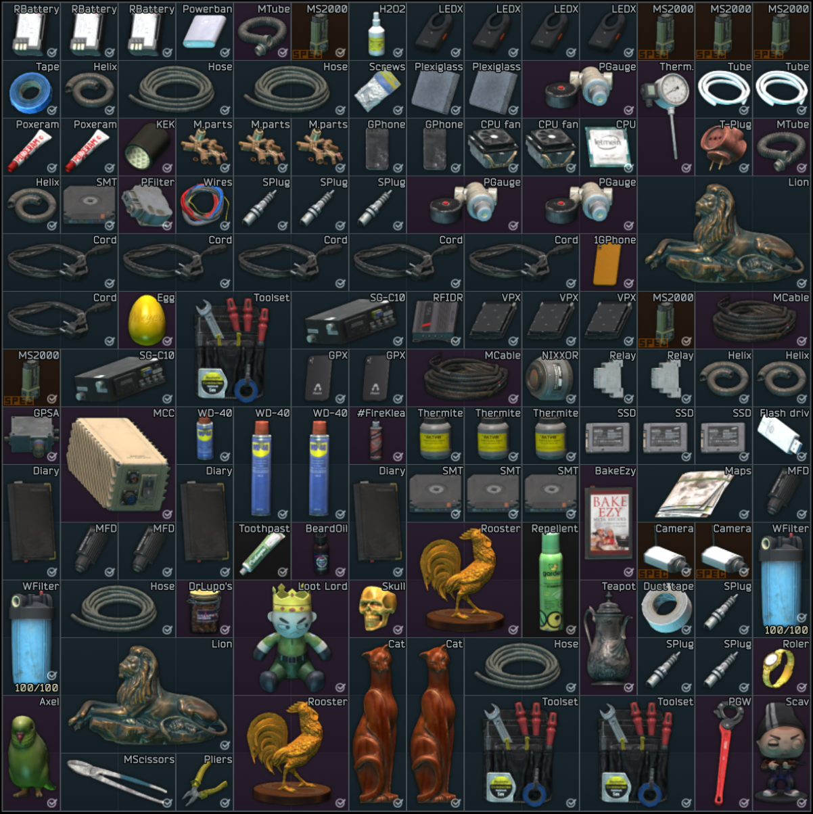

# Tarkov Item Scanner

<div align="center">
  
  <p><em>Quickly identify and value your Escape from Tarkov loot</em></p>
</div>

## 🎮 Overview

Tarkov Item Scanner is a powerful tool that uses OCR (Optical Character Recognition) technology to scan screenshots or images from Escape from Tarkov and automatically identify items and their market values. Perfect for quickly assessing the value of your raid loot or inventory!

## ✨ Features

- **Instant Item Recognition**: Upload screenshots from your Tarkov inventory and get immediate item identification
- **Price Tracking**: See the current market value of all identified items
- **Total Value Calculation**: Quickly determine the total worth of all items in your image
- **Multiple OCR Options**: 
  - Tesseract.js (local processing)
  - Google Cloud Vision API
  - **NEW: Gemini 2.0 AI Vision** for superior item recognition
- **Dark/Light Mode**: Comfortable viewing in any environment
- **Responsive Design**: Works on desktop and mobile devices

## 🚀 Getting Started

### Prerequisites

- Node.js (v16 or higher)
- npm or yarn

### Installation

1. Clone the repository:
   ```bash
   git clone https://github.com/yourusername/tarkov-item-scanner.git
   cd tarkov-item-scanner
   ```

2. Install dependencies:
   ```bash
   npm install
   # or
   yarn
   ```

3. Start the development server:
   ```bash
   npm run dev
   # or
   yarn dev
   ```

4. Open your browser and navigate to `http://localhost:5173`

## 🔧 Usage

1. **Upload an Image**: Click the upload button or drag and drop a screenshot from your Tarkov inventory
2. **Review Results**: The app will process the image and display all recognized items with their values
3. **Sort and Filter**: Organize items by name, value, or quantity
4. **Copy Results**: Easily share your findings with teammates

## 🧠 How It Works

The scanner uses advanced OCR technology to:
1. Process your uploaded image
2. Extract text from the image using your choice of OCR engine:
   - Tesseract.js (offline, runs in browser)
   - Google Cloud Vision API (requires API key)
   - Gemini 2.0 (requires API key, provides AI-powered item recognition)
3. Match the text against a database of known Tarkov items
4. Calculate values based on current market prices
5. Present the results in an easy-to-read format

## 🛠️ Technologies Used

- **React**: For the user interface
- **TypeScript**: For type-safe code
- **Tesseract.js**: For OCR processing
- **Google Gemini 2.0**: For AI-powered item recognition
- **Tailwind CSS**: For styling
- **Vite**: For fast development and building

## 🤝 Contributing

Contributions are welcome! Feel free to:
- Add new items to the database
- Improve OCR accuracy
- Enhance the UI/UX
- Fix bugs or optimize performance

Please see [CONTRIBUTING.md](CONTRIBUTING.md) for guidelines.

## 📝 License

This project is licensed under the MIT License - see the [LICENSE](LICENSE) file for details.

## 🙏 Acknowledgements

- [Escape from Tarkov](https://www.escapefromtarkov.com/) for the amazing game
- [Tesseract.js](https://tesseract.projectnaptha.com/) for OCR capabilities
- [Google Gemini](https://ai.google.dev/) for AI vision capabilities
- All contributors and supporters of this project

---

<div align="center">
  <p>Made with ❤️ for the Tarkov community</p>
</div>
